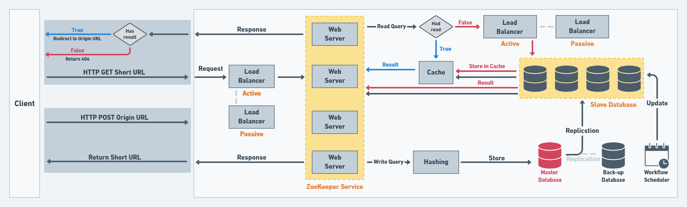

# 短網址

## 目的

開發者透過網址傳輸描述屬性（如：表示資料的結構層次、命令結構、交易路徑及對談資訊），造成了 URL 過長、形式複雜，甚者難以記憶、手動輸入及流通，導致長網址必須透過複製黏貼才能傳播。因此，縮址對於網站傳輸十分方便。

## 好處

* 把冗長的網址變短，可以避免訊息傳送時因網址過長被截斷。
* 部分短網址會在轉址到目標 URL 的過程中放置廣告，增加收益。
* 在字數限制的編輯框中，短網址可以節省字數。

## 系統設計

### 需求功能

* 使用者發出一個**長網址**，則回傳一個短網址。
* 使用者發出一個**短網址**，則重新導向至對應的長網址。
* 基於硬體成本考量，短網址具有時效性。

### 系統分析

#### Load Balancer

Load Balancer 是一個 Reverse Proxy，會將傳入的流量分散到多個 Server 中，監控各個 Server 的運作狀態，並分配流量給 idle 或 loading 較輕的 Server 運作。為避免 Single point of failure 的問題，因此增設 Load Balancer，當第一個 Load Balancer shotdown 後，第二個 Load Balancer 才會啟動，維持運作。

#### ZooKeeper Service

ZooKeeper 是分散式服務框架，為Apache Hadoop 的一個子項目，主要用來解決分散式系統中的數據管理協調問題，比如狀態同步服務、 集群管理，或是分散式應用的配置。

在這邊利用 ZooKeeper 是為了將 counter 分配至各個 Web Server 上，之後再解釋 counter 的用意。假設第一台 Server 被分配到 1～1,000,000的計數範圍，第二台 Server 被分配到 1,000,001 ～ 2,000,000 的計數範圍，依此類推。在新增 Server 前須先向 ZooKeeper 註冊，若有 Server shotdown，ZooKeeper 也能即時得知，因此不論新增或刪除 Server 都不會有 counter 亂掉的問題。

再來要說明 counter 的用途。為了避免**不同**使用者想要縮短**同一個**長網址，在沒有特別處理的情況下，會產生相同的短網址，因此不能個別分析短網址的使用狀況。counter 的用意就是，在原始的長網址後加上一個隨機的數字，也就是拿 `(original_url + incrementing_counter)` 進行 Hashing，這樣的結果有兩個優點：

1. 即使是同一個長網址，也幾乎不可能產生相同的短網址（Hashing Collision 幾乎不可能發生）

2. 因為不會產生相同的短網址，就不用額外檢查 Database 是否已經存在**一模一樣**的長網址與短網址對應關係，減少一次 Database Calling

#### Back-up Database

其功能是為了避免 Single point of failure 的問題，若在寫入資料時， Master Database 故障了，Back-up Database 可以即時頂替 Master Database 繼續運作，避免資料寫入遺失的狀況發生。

#### Workflow Scheduler

若生成的短網址為永久性，會花很多成本在儲存已經沒人使用的短網址，因此短網址通常都有時效性。當一個短網址過期時，便不再回傳長網址，之後透過 offline 的程序慢慢刪除即可。

參考資料：[系統設計 - 設計縮網址服務](https://www.jyt0532.com/2019/12/05/design-tiny-url/)
