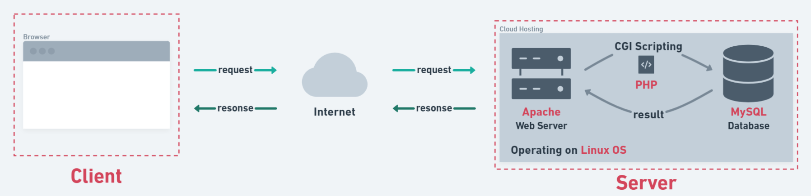

# 心得

其實先前我們已經有部署的經驗了，在**第九週：後端基礎**的課程內容中，在電腦上建置 XAMPP 環境，就是在建立網頁伺服器，讓我們可以在網路上發送 request 給 Server，Server 處理完畢後，再經由網路將 response 回覆給我們。

一般來說，檔案都會存放在網頁伺服器的本地端檔案系統中，舉例：在域名 `en.wikipedia.org` 的伺服器上設定伺服器軟體之根目錄為 `/home/public/web/`，當使用者輸入網址 `http://en.wikipedia.org/wiki/web_server.html`，在 `en.wikipedia.org` 的伺服器軟體就會讀取 `/home/public/web/wiki/web_server.html` 這個檔案。

部署網站是一個複雜的過程，牽涉到主機、作業系統、網頁伺服器、資料庫，以及網路概論中應用層的知識，部署的流程在網路上都能找到分解步驟，但在實作的過程中，「為什麼要這個流程」一直浮現在我腦中，因此想藉由部署流程，大致整理部署的概念。

## 部署流程

1. 設定 AWS EC2 虛擬主機
2. 更新 Ubuntu 作業系統
3. 建置 LAMP 網頁伺服器
4. 設定 phpMyAdmin
5. 建立域名
6. 部署程式到網頁伺服器上

### 1. 設定 AWS EC2 虛擬主機

#### 實體主機

主機是架站的必要支出，試想將一台功率 500 瓦特的實體主機放在房間 24 小時不斷電提供服務，一天就要用掉 12 度電，假設電費為 2 元／度，一年光主機電費就要 8760 元，還不包括維運、空調、防火牆、網路頻寬等成本，由此可知用一台實體主機來架站的成本是非常高昂的。

#### 虛擬主機

虛擬主機是由一台「實體主機」，經過**軟體程式**切割成數百個獨立的「虛擬空間」，而這些藉由軟體程式切分出來的每一個虛擬空間，就成為一個各自獨立的「虛擬主機」，切割出來的虛擬主機一樣能夠建立網站、資料庫、電子郵件伺服器或是安裝各種管理系統與架設平台系統，就如同一個真實的主機一樣。

#### Amazon Machine Image

> Amazon Machine Image（AMI）是一種範本，其中包含軟體組態（例如：作業系統、應用程式伺服器和應用程式）。可以從 AMI 啟動執行個體（Instance），執行個體是 AMI 的複本，在雲端中以虛擬伺服器的形式執行。


Ubuntu Server 18.04 LTS (HVM), SSD Volume Type：Ubuntu 是基於 Debian 的 Linux 發行版，是個免費開源的作業系統。Ubuntu Server 版是為執行伺服端的應用程式而設計的伺服器版本。

#### Security Group

Security Group 的功能很簡單，它只是限定某個特定的 IP、Port，或是某範圍的 IP、Port，允許他們進出主機的規則，可以把它視為一道非常簡單的防火牆。設定完 Security group 後，再套用到機器上，來限制跟這台機器有關的網路進出，這就是 Security Group 的功能。

#### 安全外殼協定（Secure Shell protocol）

安全外殼協定（Secure Shell protocol, SSH）是一個加密的協定，傳送出去的封包都是經過加密的，即使被擷取，也需要很大的功夫才能解開，比較安全。此外，SSH 也是一個會壓縮的協定，因此可以節省頻寬、加速傳遞資料等。不只如此，SSH 可以達到 Telnet 的遠端連線功能，還可以提供類似 FTP、但較安全的 sFTP 檔案傳輸等應用。

### 2. 更新 Ubuntu 作業系統

#### 連線至執行個體（Instance）

``` C
// 將 .pem 檔改成只有使用者可以讀取的權限
chmod 400 <私鑰檔案路徑>

// 透過 SSH 使用公有 DNS 連線至執行個體
ssh -i "<私鑰檔案路徑>" ubuntu@ec2-<IPv4 Public IP>.us-east-2.compute.amazonaws.com
```

#### 更新 Ubuntu 作業系統

``` c
$ sudo apt update && sudo apt upgrade && sudo apt dist-upgrade
```

Ubuntu Server 環境建置好後，需要更新系統版本到最新版，避免遇到安全性漏洞以及程式的 BUG。

##### sudo

sudo （**s**uper**u**ser **do**）是一種程式，是 Linux 允許使用者透過安全的方式，使用特殊的權限執行程式。（通常為系統的超級使用者）

##### apt

Debian 作為 Ubuntu 作業系統的母板，具有完整的「套件管理」系統，它的每個工具與應用程式都安裝在系統裡的 package 中。Debian 使用一套名為 Advanced Packaging Tool（APT）的工具來管理這個套件系統，各種工具可以與 APT 進行互動，以方便使用者安裝、刪除和管理這些工具。

### 3. 建置 LAMP 網頁伺服器

#### LAMP Stack

LAMP stack 為最常用的軟體開發方法之一，LAMP stack 允許 Web 開發人員構建、部署和管理 Web 應用程式。LAMP 是代表 Linux、Apache、MySQL 和 PHP 的首字母縮寫詞，並提供託管和管理 Web 內容所需的組件。



##### Linux：作業系統

Linux 介於硬體與應用程式之間，提供作業系統服務。每個程序實際上也在 Linux 上運行。但是，並不一定局限於 Linux，如有必要，其他組件也可以在 Microsoft® Windows®、Mac OS X 或 UNIX® 上運行。

##### Apache：網頁伺服器

Apache 是目前最受歡迎的網頁伺服器，網頁伺服器負責在網路之間傳遞資訊並遵循 HTTP（通訊安全協定）的規範、將網頁資料儲存於伺服器。當 Client 在網址列上輸入一串網址時，會向 Server 發出一個 request，而 Server 就會遵照 HTTP 協定，取出該網頁的資料並回傳給 Client。

##### MySQL：資料庫

MySQL 提供 LAMP stack 的數據存儲端。在 Web 應用程式中，所有數據、產品、帳戶和其他類型的信息都存放在 MySQL 資料庫中，通過 SQL 語言可以很容易地查詢這些信息。

##### PHP：程式語言

超文本預處理器，通常稱為 PHP，是一種用於創建動態 Web 內容的通用腳本語言。因為 HTML 是一個靜態處理器，所以將 PHP 腳本插入到頁面中可以啟用動態 Web 應用程序。

在 LAMP 架構的網站中，當 Client 向 Server 上的 Apache 要求連線後，若 Apache 發現 Client 要求的網頁檔內容包含 PHP 時，就會先送到 PHP 直譯器去執行。若程式碼裡面有需要查詢資料庫的地方，就由 PHP 引擎和 MySQL 查詢資料，接著 PHP 把單純的 HTML 結果送回去給 Apache，最後再交給 Client 端的瀏覽器顯示。所以在客戶端是完全沒有執行到程式的，它只不過是把伺服器送來的資料單純顯示出來而已，所有的計算都是在伺服器上完成，所以伺服器上也可以選用不同的網頁程式語言，如 perl 或 python 等，完全不會影響到客戶端的結果。

#### LAMP 設定步驟

一、安裝 Tasksel 套件：使用 Tasksel 能快速配置 LAMP 環境

``` c
$ sudo apt install tasksel
```

二、使用 Tasksel 下載 LAMP server

``` c
$ sudo tasksel install lamp-server
```

### 4. 設定 phpMyAdmin

安裝 phpMyAdmin

``` c
$ sudo apt install phpmyadmin
```

之後的 phpMyAdmin configuration 與 MySQL 登入設定我是參考 [[week 14] 網站部署 - 設定 AWS EC2 遠端主機 + Ubuntu LAMP 環境 + phpMyAdmin](https://heidiliu2020.github.io/backend-aws-ubuntu/) 完成後續動作。

在 MySQL 安裝完成進入資料庫後，點選任一的資料表都會跳出錯誤訊息，後來根據 [Problem with phpMyAdmin and PHP 7.2: “Warning in ./libraries/sql.lib.php#613 count(): Parameter must be an array or an object that implements Countable”](https://devanswers.co/problem-php-7-2-phpmyadmin-warning-in-librariessql-count/) 的參考資料排除問題。

### 5. 設定域名

網址通常是一串英文組成的，例如 `https://3csilo.com/what-is-url/`，它就像是你家的門牌地址一樣，有地址就找得到你家在哪裡。

而主機就像是你的房子，有房子才能夠容納裡面的傢俱擺設。而主機就是用來放置網站的程式和內容。

就像大家用地址就能找到你的房子；如同打上網址就能找到主機、看到網站內容一樣。


網址不等同於網域名稱，但是網址中一定會包含網域名稱。網域名稱就是網站的主要名稱，網址的定義就是導向特定網站的頁面。如圖說明：


>網域名稱（Domain Name）簡稱域名、網域，是由一串用「點」分隔的字元組成，為網際網路上某一台電腦或電腦組的名稱，用於在資料傳輸時識別電腦的電子方位。域名可以說是一個 IP 位址的代稱，目的是為了便於記憶 IP。例如：`wikipedia.org` 是一個域名，人們可以直接存取 `wikipedia.org` 來代替 IP 位址，域名系統（Domain Name System, DNS）就會將它轉化成便於機器辨識的 IP 位址。這樣，人們只需要記憶 `wikipedia.org` 這一串帶有特殊含義的字元，而不需要記憶沒有含義的數字。

購買好網域後，可以到網域商後台設定 A record 與 CNAME record。

將瀏覽器比喻成計程車司機，假設今天我想去台北 101，我可以跟計程車司機說，麻煩前往「台北市信義區信義路五段 7 號」，這個詳細的地址就如同目標網站的 IP 位址。

但今天我不知道詳細地址怎麼辦？難道就不能前往目的地了嗎？也不會，即使我不知道詳細的地址，但我跟司機說麻煩前往「台北 101」，他還是能把我載到目的位置。

A record 就是一種設定名稱與 IP 位置相對應的紀錄，例如：「台北 101」與「台北市信義區信義路五段 7 號」的關係，他們都是指向同一個目的地。

CNAME record 與 A record 不同的是，CNAME 指向的是一個名稱而不是一個 IP 位置。假設我今天想要去位於「台北市信義區信義路五段 7 號 2 樓」的餐廳吃飯，與其跟計程車司機說餐廳的詳細地址，不如直接跟司機說麻煩前往「台北 101」，因為餐廳就位於台北 101 裡面，目的地還是「台北市信義區信義路五段 7 號」。

### 6. 部署程式到網頁伺服器上

透過 FileZilla 使用 key-pairs 登入 AWS EC2 存取檔案，就像繳交課程作業一樣，有 PHP 檔時都要將檔案上傳到 FTP 主機 `mentor-program.co` 上，除了連線設定略有差異外，其他上傳檔案的方式與繳交作業相同。

---

網站部署照著學長姐的筆記，過程非常的順遂，透過這篇心得也重新整理了我對部署的概念，如果理解有誤，煩請助教指導，謝謝。
